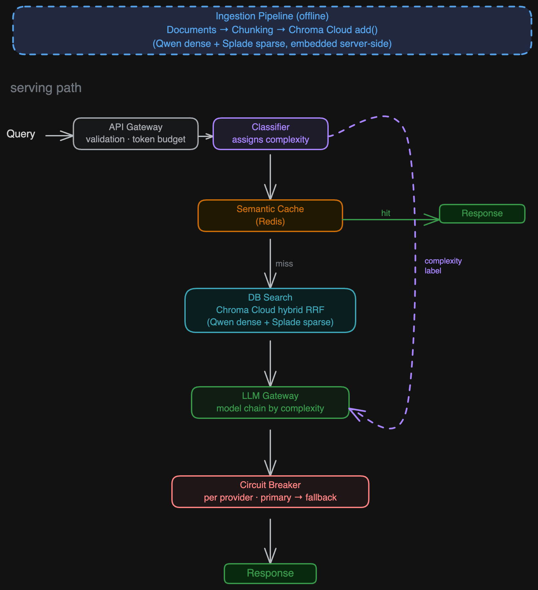

# rag-production

A production-grade RAG (Retrieval-Augmented Generation) reference implementation. Covers the full system design — from document ingestion to multi-model fallback — with every architectural decision documented and each layer independently testable.

Built as a learning resource for engineers who want to understand how a RAG system is designed for production, not just how to get one running locally.

---

## Architecture



> To update the diagram: open [`docs/architecture.excalidraw`](docs/architecture.excalidraw) at [excalidraw.com](https://excalidraw.com) and export as PNG.

| Layer | Responsibility |
|---|---|
| **Ingestion** | Chunking + indexing into Chroma Cloud (embeddings handled server-side) |
| **API Gateway** | Request validation, token budget enforcement per request |
| **Classifier** | Assigns complexity label (`simple` / `medium` / `complex`) to each query |
| **Semantic Cache** | Redis-backed similarity cache — hit skips DB search and LLM entirely |
| **DB Search** | Hybrid search via Chroma Cloud native RRF (Qwen dense + Splade sparse) |
| **LLM Gateway** | Model selection by complexity tier, fallback orchestration, token accounting |
| **Circuit Breaker** | Per-provider health tracking — open circuit skips to next provider |
| **Monitoring** | Async RAGAS sampling on 10% of live traffic + chunk hit rate |

## Tech Stack

| Concern | Choice |
|---|---|
| Language | Python 3.11+ |
| Vector DB | [Chroma Cloud](https://trychroma.com) |
| Semantic cache | [Redis Cloud](https://redis.io/try-free) + Google `gemini-embedding-001` |
| Observability + Monitoring | [Axiom](https://axiom.co) via OpenTelemetry |
| Evaluation | RAGAS |
| LLM — simple | Gemini 2.5 Flash Lite (primary) → Claude Haiku (fallback) |
| LLM — medium | Gemini 2.5 Flash (primary) → Claude Sonnet → GPT-4o-mini (fallback) |
| LLM — complex | Gemini 2.5 Flash (primary) → Claude Sonnet → GPT-4o (fallback) |
| Classifier | Gemini 2.5 Flash Lite |

## Prerequisites

- Python 3.11+
- [uv](https://docs.astral.sh/uv/) (recommended) or pip
- A [Chroma Cloud](https://trychroma.com) account — free tier ($5 credit) is sufficient
- A [Redis Cloud](https://redis.io/try-free) account — free tier (30 MB, no credit card required) is sufficient
- An [Axiom](https://axiom.co) account — free tier (500 GB/month, no credit card required) is sufficient
- API keys: Anthropic and Google (required); OpenAI (optional — only needed for the medium/complex fallback chain)

## Setup

**1. Clone and install dependencies**

```bash
git clone https://github.com/alexandre-queiroz/rag-blueprint
cd rag-production
uv sync
# or: pip install -e .
```

**2. Configure environment**

```bash
cp .env.example .env
```

Fill in `.env` with credentials from each service:

**Chroma Cloud** — available at [trychroma.com](https://trychroma.com). No credit card required for the free tier. Steps:
1. Create a free account
2. A default database (`default_database`) is created automatically — or create a new one
3. Go to **Settings > API Keys** and generate a new API key
4. Copy the **API Key**, **Tenant**, and **Database** name into `.env`

**Redis Cloud** — available at [redis.io/try-free](https://redis.io/try-free). No credit card required. Steps:
1. Create a free account
2. Click **New database** → select the **Free** plan (30 MB)
3. Once the database is active, open it and click **Connect**
4. Copy **Host**, **Port**, and **Password** into `.env` — `REDIS_USERNAME` is always `default` on the free plan

**Axiom** — available at [axiom.co](https://axiom.co). No credit card required. Steps:
1. Create a free account
2. Go to **Datasets** and create a new dataset named `rag-blueprint` (or any name — update `AXIOM_DATASET` accordingly)
3. Go to **Settings > API Tokens** and generate a new token with ingest + query permissions
4. Copy the **API Token** and **Dataset** name into `.env`

**API keys** — Anthropic, Google, and OpenAI consoles linked in `.env.example`.

**3. Verify connections**

```bash
# Chroma Cloud
uv run python -c "from dotenv import load_dotenv; load_dotenv(); from rag.vector_db.client import get_client; print(get_client().heartbeat())"

# Redis Cloud
uv run python -c "from dotenv import load_dotenv; load_dotenv(); import redis, os; r = redis.Redis(host=os.getenv('REDIS_HOST'), port=int(os.getenv('REDIS_PORT')), password=os.getenv('REDIS_PASSWORD'), decode_responses=True); print(r.ping())"

# Axiom (sends a test span via OTLP — check your dataset for a 'connectivity-check' span)
uv run python -c "
from dotenv import load_dotenv; load_dotenv()
import os
from opentelemetry.exporter.otlp.proto.http.trace_exporter import OTLPSpanExporter
from opentelemetry.sdk.resources import Resource
from opentelemetry.sdk.trace import TracerProvider
from opentelemetry.sdk.trace.export import SimpleSpanProcessor
e = OTLPSpanExporter(endpoint='https://api.axiom.co/v1/traces', headers={'Authorization': f'Bearer {os.getenv(\"AXIOM_API_KEY\")}', 'X-Axiom-Dataset': os.getenv('AXIOM_DATASET')})
p = TracerProvider(resource=Resource.create({'service.name': 'rag-production'}))
p.add_span_processor(SimpleSpanProcessor(e))
with p.get_tracer('verify').start_as_current_span('connectivity-check'): pass
p.shutdown()
print('Axiom OK')
"
```

## Running the Pipeline

You can run the document Ingestion and query the RAG serving pipeline end-to-end directly from your CLI.

### 1. Ingest Documentation

The offline ingestion script reads documentation files from `docs/` and indexes them into Chroma Cloud using a robust parent-child chunking strategy (see ADR-002):

```bash
uv run python ingest_docs.py
```

### 2. Query the Pipeline

Use the interactive CLI `query.py` to send queries to the full RAG serving path:

```bash
# Query as a CLI argument
uv run python query.py "What is the token budget per request?"

# Or start in interactive mode (Ctrl+D to exit)
uv run python query.py
```

#### Cache Miss Example (First Call)
On the first call, the query misses the cache. The pipeline runs hybrid search (dense Qwen + sparse Splade), routes the request to the correct LLM provider (Anthropic or Google Gemini fallback), prints the response, and starts an async task to write the result to the semantic cache:

```text
 Query: What is the token budget per request?

 Answer:
The token budget per request is defined by `max_tokens_per_request`.

 Sources: adr-009-token-budget.md, architecture.md, adr-005-llm-gateway-litellm.md
 Complexity: simple
 Model: gemini/gemini-2.5-flash-lite  |  tokens: 2411  |  $0.00025  |  799ms
```

#### Cache Hit Example (Subsequent Call)
On a subsequent identical (or semantically similar) query, the Redis semantic cache hits immediately, skipping vector database lookup and external LLM calls entirely for near-zero latency:

```text
 Query: What is the token budget per request?

 Answer:
The token budget per request is defined by `max_tokens_per_request`.

 [cache hit]
```

## Project Structure

```
rag-production/
├── src/rag/
│   ├── ingestion/         # Chunking strategies + Chroma Cloud indexing
│   ├── classifier/        # Three-stage complexity classification pipeline
│   ├── cache/             # Semantic cache (Redis + gemini-embedding-001)
│   ├── gateway/           # LLM Gateway — model selection, fallback, token accounting
│   ├── circuit_breaker/   # Per-provider circuit breaker (pybreaker)
│   ├── monitoring/        # Async RAGAS sampling on live traffic
│   ├── vector_db/         # Chroma Cloud client and hybrid search
│   ├── config.py          # Typed config loader (reads config.yaml)
│   └── types.py           # Shared types (ComplexityLabel, RAGResponse, etc.)
├── docs/
│   ├── adrs/              # Architecture Decision Records
│   ├── architecture.md    # Full system design documentation
│   ├── architecture.png   # Architecture diagram (export from architecture.excalidraw)
│   └── architecture.excalidraw
├── config.yaml            # All provider, budget, and cache settings
├── .env.example           # Required environment variables (copy to .env)
├── pyproject.toml
└── CLAUDE.md              # Context for AI coding assistants
```

## Configuration

All runtime settings live in `config.yaml`: LLM providers and fallback chains per complexity tier, circuit breaker thresholds, token budget, semantic cache, and RAGAS evaluation parameters.

> In production, these values should be managed by a config service (AWS AppConfig, LaunchDarkly, etc.) to allow changes without redeploy. See the note in `config.yaml`.

## Architectural Decisions

Every non-trivial decision has an ADR in [`docs/adrs/`](docs/adrs/). Read them before implementing or changing anything — they document the alternatives considered, the rationale, and the consequences.

| ADR | Decision |
|---|---|
| [ADR-001](docs/adrs/adr-001-vector-db.md) | Vector Database — Chroma Cloud |
| [ADR-002](docs/adrs/adr-002-chroma-cloud-embeddings.md) | Embeddings — Chroma Cloud Native (Qwen + Splade) |
| [ADR-003](docs/adrs/adr-003-no-framework.md) | Orchestration — No RAG Framework (LangChain / LlamaIndex) |
| [ADR-004](docs/adrs/adr-004-semantic-cache.md) | Semantic Cache — Redis + Google embedding |
| [ADR-005](docs/adrs/adr-005-llm-gateway-litellm.md) | LLM Gateway — LiteLLM |
| [ADR-006](docs/adrs/adr-006-llm-gateway-routing.md) | LLM Gateway — Complexity-Aware Routing |
| [ADR-007](docs/adrs/adr-007-circuit-breaker-pybreaker.md) | Circuit Breaker — pybreaker |
| [ADR-008](docs/adrs/adr-008-evaluation.md) | Evaluation Framework — RAGAS |
| [ADR-009](docs/adrs/adr-009-token-budget.md) | Token Budget — Per Request |
| [ADR-010](docs/adrs/adr-010-observability-axiom.md) | Observability and Monitoring — Axiom |

## Running Evaluations

RAGAS is used for both offline evaluation (pre-deploy against a fixed dataset) and online sampling (10% of live traffic by default). Install the eval dependencies first:

```bash
uv sync --extra eval --extra monitoring
```

Thresholds are configured in `config.yaml` under `evaluation`. The `min_score_threshold` default of `0.75` is a starting point — calibrate it with real traffic data.

Each sampled request produces one `ragas.evaluation` span in Axiom with quality scores and full operational metadata:

```json
{
  "name": "ragas.evaluation",
  "scope": { "name": "rag.monitor" },
  "service": { "name": "rag-production" },
  "attributes": {
    "custom": {
      "rag.query": "What are the consequences of opening the circuit breaker?",
      "rag.complexity": "simple",
      "rag.cached": false,
      "rag.faithfulness": 1.0,
      "rag.answer_relevancy": 0.796,
      "rag.context_precision": 0.95,
      "rag.alert": false,
      "rag.below_threshold": "",
      "rag.model": "gemini/gemini-2.5-flash-lite",
      "rag.provider": "google",
      "rag.total_tokens": 2079,
      "rag.cost_usd": 0.0002157,
      "rag.latency_ms": 822.17
    }
  }
}
```

`rag.alert: true` fires when any metric drops below `min_score_threshold` — use it to build an Axiom monitor or alert rule.

## Want to Run Fully Local?

The managed services (Chroma Cloud, Redis Cloud, Axiom) are used to keep infrastructure setup out of the way. Each can be replaced with a local alternative.

**Vector DB — Chroma Cloud → Chroma embedded:**
1. Replace `CloudClient` with the Chroma embedded client in `src/rag/vector_db/client.py`
2. Remove the `Schema` (sparse embeddings are a Chroma Cloud feature)
3. Add your own embedding pipeline (e.g. `text-embedding-3-small`) before `collection.add()`
4. Implement BM25 + RRF manually for hybrid search

See [ADR-001](docs/adrs/adr-001-vector-db.md) for the full trade-off analysis.

**Semantic Cache — Redis Cloud → Redis via Docker:**
```bash
docker run -d -p 6379:6379 redis:7
```
Update `.env`: `REDIS_HOST=localhost`, `REDIS_PORT=6379`, `REDIS_PASSWORD=` (empty).

**Observability — Axiom → structured logs:**

Remove the Axiom emit in `src/rag/monitoring/monitor.py` (`_emit_to_axiom`) and replace it with a `logging.getLogger(__name__).info(event)` call. RAGAS scores and alerts will appear in stderr/stdout and can be ingested by any log aggregator (Datadog, Loki, CloudWatch).

For infrastructure metrics (latency, cost, token usage), expose a `/metrics` endpoint and scrape with Prometheus + Grafana. Note that Prometheus's pull model is a less natural fit for discrete per-request quality events than Axiom's push ingestion — see [ADR-010](docs/adrs/adr-010-observability-axiom.md) for the trade-off analysis.

## License

MIT
